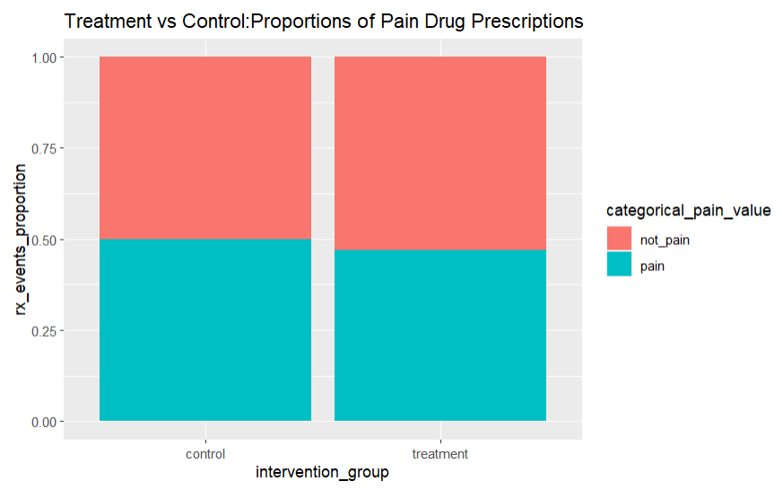
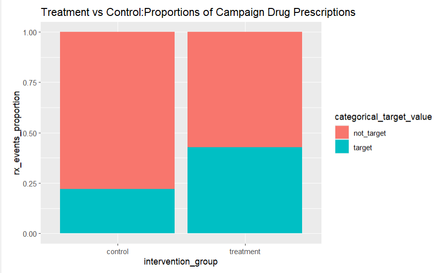
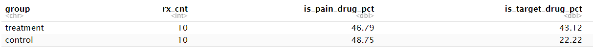

# drug_sale_campaign

## About project

When a new drug hits the market, not every clinician is aware of the drug treatment because there are too much information on the web these days. One way to promote a new drug awareness is through campaigns. This could be advertisements on certain medical related websites or targeted messages in certain medical software applications like a prescribing application. 

This project focuses on evaluating a campaign effectiveness to promote a new drug called 'FEELA-GOOD' . FEELA-GOOD is a medication that relieves pain and makes you feel good. This is a special drug because it has no side effects except maybe emptying your cash wallet.We are all aware of the danger of opioids in pain management. Opioids are great for relieving pain but there are high risk of addiction and overdose that might lead to death. According to CDC, in 2021, over 75% of the approximately 107,000 drug overdose fatalities were attributed to opioids.This translates to a staggering 80,000+ lives lost to opioid overdoses in the same year, equating to an average of 220 individuals per day. It's crucial to recognize that these figures are likely conservative estimates, and the opioid crisis is likely to escalate, as evidenced by numerous tragic overdose incidents reported in the news.

## About the Data set

This  synthetic dataset gives information about the doctors'  prescription behavior and whether the doctor has seen the promotional message or not. There are only 6 columns. We will use the data to analyze if the messaging had any positive lift in 'FEELA-GOOD' prescriptions. There will be visuals to view data in different segments.Finally a T-test will be used to see if the campaign effect is statistically significant.

* Attribute Information
  +	rx_id 
      +	__Meaning__: The unique ID for the prescription
      +	__Variable Type__: character
      +	__Possible values__:  any number from 1 to infinity
  +	doctor_id 
      +	__Meaning__: The unique ID of a  doctor 
      +	__Variable Type__: character
      +	__Possible values__:  any number from 1 to infinity
  +	drug_name 
      +	__Meaning__: Name of the drug. Could be brand or generic name.
      +	__Variable Type__: character
      +	__Possible values__:  'OXYCODONE' , 'APIXABAN', 'FEELA-GOOD',etc
  +	is_pain_drug 
      +	__Meaning__: Is the drug used for pain or not. 1 if yes. 0 if no.
      +	__Variable Type__: integer
      +	__Possible values__:  1 or 0     

  +	is_target_drug 
      +	__Meaning__: Is the drug being prescribed the drug of interest? 1 if yes. 0 if no.
      +	__Variable Type__: integer
      +	__Possible values__:  1 or 0

  +	has_seen_msg 
      +	__Meaning__: Did the doctor see the campaign message?  1 if yes. 0 if no.
      +	__Variable Type__: integer
      +	__Possible values__:   1 or 0

## Group Comparison graph 1

- Insight: We can see that the overall salary distribution is skewed to the right.
- Insight: We see that gender and healthcare major have lots of overlap so they don't seem to influence salary.
- Insight: However,there seems to be a difference in salary versus filling a medication. Higher salary seems to fill their medication versus lower salary.

## Group Comparison graph 2

- insight: Gender doesn't seem to play a role as the proportions of filling or not are pretty even between the genders
- insight: Seems like those that were healthcare major in college would influence a person's decision to pick up the medication. Visually, we can see those that were healthcare majors in college had much high proportions of filling. Those that weren't in healthcare majors in college had much higher proportions of not filling the medication. 

## Group Comparison table with attributes

- insight: Gender doesn't seem to play a role as the proportions of filling or not are pretty even between the genders
- insight: Seems like those that were healthcare major in college would influence a person's decision to pick up the medication. Visually, we can see those that were healthcare majors in college had much high proportions of filling. Those that weren't in healthcare majors in college had much higher proportions of not filling the medication. 

## Conclusion
- The campaign had a positive relative lift of (43.1-22.2)/(22.2) = 94% for Feela-Good drug. This was statistically significant with a p-value < 0.001. The A/B testing shows that the campaign intervention was very effective in promoting the new drug. We should roll out more campaigns to doctors that share similiar attributes to the test/control group.